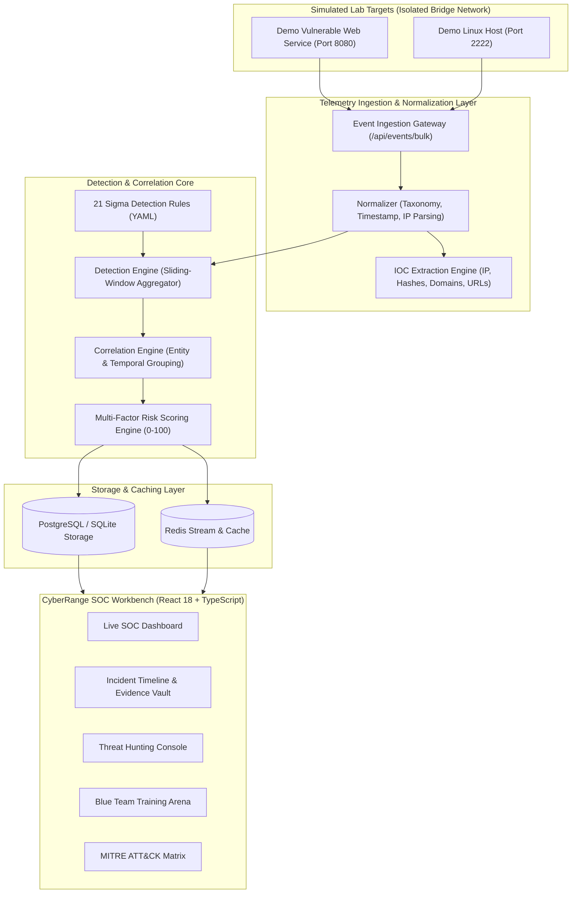

# CYBERRANGE: Attack Detection & Investigation Lab

<div align="center">


**An isolated, production-grade cybersecurity training and threat detection platform simulating the end-to-end defensive SOC lifecycle.**

[Features](#-key-features) • [Architecture](#-system-architecture) • [Quickstart](#-quickstart--installation) • [Detection Rules](#-detection-engineering-rules) • [Blue Team Walkthrough](#-5-minute-investigation-walkthrough) • [Interview Q&A](#-interview-explanation--questions)

</div>

---

## 🎯 1. Core Objective & Why CyberRange Exists

Real-world SOC and Blue Team operations require mastering more than simple static alerts or isolated scripts. Security engineers must understand the entire chain:
**Telemetry Generation $\to$ Normalization $\to$ Detection $\to$ Correlation $\to$ Risk Scoring $\to$ Investigation $\to$ Remediation $\to$ Reporting.**

**CyberRange** was built to replicate this enterprise workflow in an isolated, safe, containerized environment without external dependencies or real malware risks.

```
ATTACK SIMULATION
        ↓
LOG GENERATION & EMISSION
        ↓
LOG INGESTION & NORMALIZATION
        ↓
DETECTION ENGINE (Sigma-Inspired Rules)
        ↓
ALERT GENERATION
        ↓
TEMPORAL & ENTITY CORRELATION
        ↓
INVESTIGATION WORKBENCH (Timeline & SHA-256 Evidence)
        ↓
INCIDENT RESPONSE & PLAYBOOKS
        ↓
SECURITY REPORTING & POST-MORTEM
        ↓
LIVE SOC DASHBOARD (WebSockets)
```

---

## 🚀 2. Key Features

- 🛡️ **Real-Time Detection Engine**: Evaluates 21 Sigma-inspired behavioral detection rules with sliding-window thresholds, group-by aggregations, regex matches, and cooldown suppression.
- 🔗 **Smart Alert Correlation**: Automatically clusters isolated alerts by host, attacker source IP, targeted username, and temporal proximity into single actionable incidents.
- 📊 **Transparent 0–100 Risk Engine**: Multi-factor deterministic risk calculation based on severity, confidence, event velocity, asset criticality, and MITRE kill chain impact.
- 🔍 **Threat Hunting Workbench**: Query builder utilizing filter expressions (`action = "login_failed" OR severity = "high"`) with saved queries, history, and CSV export.
- ⚡ **1-Click Attack Simulator**: 7 realistic attack scenarios (SSH Brute Force, Web SQLi/Traversal, Port Scan, Privilege Escalation, Obfuscated Shell, Data Exfiltration, Multi-Stage Intrusion).
- 🎓 **Blue Team Training Simulator**: Blind triage mode evaluating analyst investigation findings against ground truth and awarding an objective 0–100 Training Score.
- 🔐 **Evidence Vault with SHA-256 Verification**: Collects logs, indicators, and screenshots with automatic cryptographic hashing for legal chain of custody.
- 📄 **Executive Security Reports**: Instant compilation of incident post-mortems in Markdown, JSON, and CSV formats.
- 📡 **Live WebSocket Telemetry**: Instant push notifications when critical alerts trigger in the lab.
- 🛡️ **Strict Lab Isolation**: All simulated activity is restricted to local containers (`lab-linux-01`, `lab-web-01`). No external targets or malicious payloads.

---

## 🏗️ 3. System Architecture



---

## 🛠️ 4. Technology Stack

| Layer | Technologies |
| :--- | :--- |
| **Backend API & Core** | Python 3.12+, FastAPI, Pydantic v2, Uvicorn, WebSockets |
| **Database & ORM** | SQLAlchemy 2.0 (Async), SQLite / PostgreSQL 16, Alembic |
| **Caching & Broker** | Redis 7 |
| **Detection & Security** | Sigma-inspired YAML Rules, MITRE ATT&CK® Enterprise v14, SHA-256 Hashing |
| **Frontend UI** | React 18, TypeScript, Vite, Tailwind CSS, Recharts, Lucide Icons, Axios |
| **Testing** | Pytest, Pytest-Asyncio, HTTPX |
| **Containerization** | Docker, Docker Compose |

---

## ⚡ 5. Quickstart & Installation

### Option A: Complete Docker Compose Stack (Recommended)

```bash
# 1. Clone the repository
git clone https://github.com/your-username/cyberrange.git
cd cyberrange

# 2. Copy environment file
cp .env.example .env

# 3. Build and launch all containers
docker compose up -d

# 4. Open the web interfaces:
# - SOC Dashboard: http://localhost:3000
# - Backend OpenAPI Docs: http://localhost:8000/docs
# - Lab Web Service: http://localhost:8080
```

### Option B: Local Developer Mode

```bash
# 1. Backend Setup
cd backend
python -m venv venv
# On Windows:
.\venv\Scripts\activate
# On Linux/macOS:
# source venv/bin/activate

pip install -r requirements.txt
python ../scripts/seed_database.py
uvicorn app.main:app --reload --port 8000

# 2. Frontend Setup (New Terminal)
cd ../frontend
npm install
npm run dev
# Access frontend at http://localhost:5173
```

---

## 🛡️ 6. Detection Engineering Rules (21 Rules)

CyberRange includes 21 Sigma-inspired YAML detection rules across 5 critical enterprise threat vectors:

```
detection-rules/
├── authentication/
│   ├── CR-AUTH-001.yaml (Multiple Failed Logins / Brute Force)
│   ├── CR-AUTH-002.yaml (Successful Login After Repeated Failures)
│   ├── CR-AUTH-003.yaml (Login from Unusual / External IP)
│   └── CR-AUTH-004.yaml (Password Spraying / Multiple Users Targeted)
├── web/
│   ├── CR-WEB-001.yaml (SQL Injection Pattern in HTTP Query/Body)
│   ├── CR-WEB-002.yaml (Cross-Site Scripting Indicator)
│   ├── CR-WEB-003.yaml (Path Traversal / Directory Probing)
│   ├── CR-WEB-004.yaml (Sensitive Endpoint Probing - .env, /admin)
│   └── CR-WEB-005.yaml (High-Volume HTTP Error Anomaly)
├── endpoint/
│   ├── CR-END-001.yaml (Suspicious Shell Spawning from Web Server)
│   ├── CR-END-002.yaml (Encoded / Obfuscated Command Execution)
│   ├── CR-END-003.yaml (Unexpected Interactive Shell from Daemon)
│   └── CR-END-004.yaml (Suspicious Parent-Child Process Relationship)
├── network/
│   ├── CR-NET-001.yaml (Network Port Scanning Pattern)
│   ├── CR-NET-002.yaml (Repeated Outbound Connection Failures)
│   ├── CR-NET-003.yaml (Abnormal Outbound Data Transfer Volume)
│   └── CR-NET-004.yaml (Suspicious DNS Tunneling / High Entropy)
└── privilege/
    ├── CR-PRIV-001.yaml (Sudo Privilege Escalation Anomaly)
    ├── CR-PRIV-002.yaml (Unexpected Administrative Action)
    ├── CR-PRIV-003.yaml (Sensitive File Access - /etc/shadow, SAM)
    └── CR-PRIV-004.yaml (Unauthorized Local Account Creation)
```

---

## 📈 7. Deterministic Risk Scoring Formula

Unlike black-box models, CyberRange uses a clear, auditable formula:

$$\text{Risk Score} = \min\left(100, \text{Severity Weight} + \text{Confidence Weight} + \text{Event Velocity} + \text{Asset Criticality} + \text{MITRE Impact}\right)$$

- **Severity Weight**: Info (0), Low (10), Medium (25), High (45), Critical (60)
- **Confidence Weight**: $0.0 \to 1.0 \times 15\text{ pts}$
- **Event Velocity**: Scaled $0 \to 10\text{ pts}$ based on alert frequency
- **Asset Criticality**: Core Servers (10 pts), Endpoints (5 pts)
- **MITRE Kill Chain Impact**: Recon (5 pts), Access (10 pts), Execution (15 pts), Privilege Escalation (20 pts), Exfiltration (25 pts)

---

## 🕵️ 8. 5-Minute Investigation Walkthrough

1. **Authentication**: Sign in to `http://localhost:3000` with username `admin` / password `CyberRange2026!`.
2. **Dashboard Overview**: Inspect baseline telemetry from 10,000+ normalized events, real-time alert distribution charts, and MTTA/MTTR metrics.
3. **Trigger Simulation**: Navigate to **Attack Simulation Lab** and click **Run Simulation** on `SCENARIO-007 (Multi-Stage Intrusion)`.
4. **Live Detection**: Observe real-time WebSocket alert notifications firing as reconnaissance, authentication, execution, privilege escalation, and exfiltration stages progress.
5. **Correlated Incident**: Open **Incidents** to see the 5 alerts automatically correlated into a single critical incident (`Risk Score: 94/100`).
6. **Investigate Timeline & IOCs**: Inspect the chronological execution timeline, review extracted threat source IP (`192.168.1.150`), and verify SHA-256 evidence digests.
7. **Execute Containment**: Run the response action playbook to isolate the compromised container host and rotate user credentials.
8. **Export Post-Mortem**: Generate an Executive Security Report in Markdown or JSON format for stakeholders.

---

## 🧪 9. Automated Testing Suite

CyberRange includes a comprehensive automated test suite validating normalization, rule detection, correlation, risk scoring, security boundaries, and RBAC:

```bash
# Run backend pytest test suite
pytest backend/tests -v
```

```
backend/tests/test_normalizer.py::test_normalizer_ssh_auth PASSED
backend/tests/test_normalizer.py::test_normalizer_nginx_web PASSED
backend/tests/test_normalizer.py::test_ioc_extraction PASSED
backend/tests/test_detection_engine.py::test_detection_rule_brute_force_positive PASSED
backend/tests/test_detection_engine.py::test_detection_rule_brute_force_negative PASSED
backend/tests/test_detection_engine.py::test_detection_rule_sqli PASSED
backend/tests/test_detection_engine.py::test_detection_rule_privilege_escalation PASSED
backend/tests/test_risk_scoring.py::test_risk_score_calculation PASSED
backend/tests/test_api_auth.py::test_auth_login_success PASSED
backend/tests/test_api_auth.py::test_auth_login_invalid_password PASSED
backend/tests/test_api_incidents.py::test_incidents_crud PASSED
backend/tests/test_simulations.py::test_run_simulation_scenario PASSED
backend/tests/test_security.py::test_unauthorized_access PASSED
backend/tests/test_security.py::test_rbac_viewer_restriction PASSED
backend/tests/test_security.py::test_sql_injection_defense PASSED
backend/tests/test_security.py::test_evidence_hashing_sha256 PASSED
backend/tests/test_security.py::test_blue_team_training_scoring PASSED

17 passed in 4.82s
```

---

## 💼 10. Resume / Portfolio Description

> **CyberRange — End-to-End SOC Detection & Incident Response Platform**
> - Architected a production-quality cybersecurity detection platform utilizing **FastAPI**, **Async SQLAlchemy**, **PostgreSQL**, **Redis**, and **React 18/TypeScript**.
> - Engineered an extensible detection engine processing 10,000+ normalized security events against **21 Sigma-inspired behavioral rules** mapped to **MITRE ATT&CK® Enterprise** techniques.
> - Developed an automated temporal and entity correlation engine clustering multi-stage alerts into unified incidents with deterministic **0–100 risk scoring**.
> - Implemented an interactive **Threat Hunting Workbench**, **SHA-256 evidence chain of custody**, **Blue Team training simulation arena**, and **real-time WebSocket** alert streaming.

---

## 🎤 11. Interview Explanation & Common Q&A

### How would you explain CyberRange in 60 seconds?
> *"CyberRange is a full-lifecycle defensive cybersecurity engineering lab. It bridges offensive attack simulation with enterprise SOC operations. When an attack scenario executes in an isolated sandbox, the platform ingests diverse log streams, normalizes them into a common taxonomy, evaluates 21 Sigma-inspired behavioral rules with sliding-window thresholds, and correlates related alerts across hosts and threat IPs into a single high-context incident. Analysts can explore the chronological timeline, query raw events with a Threat Hunting DSL, verify SHA-256 hashed evidence, execute containment playbooks, and generate executive post-mortems."*

### Common Interviewer Questions & Answers

**Q1: Why build a custom detection engine instead of just using Elasticsearch or Splunk?**
> *A: Building a custom detection engine demonstrates fundamental mastery of SIEM internals: stateful sliding-window aggregation, distinct-key grouping, suppression cooldowns, and rule compilation. It provides complete transparency into how queries execute and how deterministic risk scores are computed without opaque black boxes.*

**Q2: How does the correlation engine prevent alert fatigue in the SOC?**
> *A: In real SOC environments, a single multi-stage intrusion can trigger dozens of individual alerts (e.g., failed logins, successful login, sudo command, shell spawn). CyberRange correlates alerts sharing an affected asset, attacker IP, or targeted username within a sliding temporal window into one unified incident, grouping alerts together so analysts triage the entire kill chain rather than fragmented noise.*

**Q3: How do you guarantee the safety of simulated attacks?**
> *A: CyberRange enforces strict architectural isolation: all simulations run exclusively against local containerized test targets (`lab-linux-01`, `lab-web-01`). No real malware or destructive commands are used, and no outbound network probes are ever transmitted to external internet addresses.*

---

## 📄 License

This project is licensed under the **MIT License** — see the [LICENSE](LICENSE) file for details.
