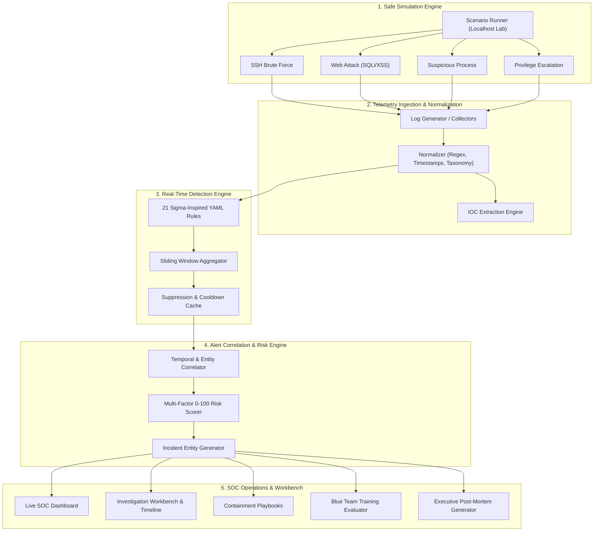
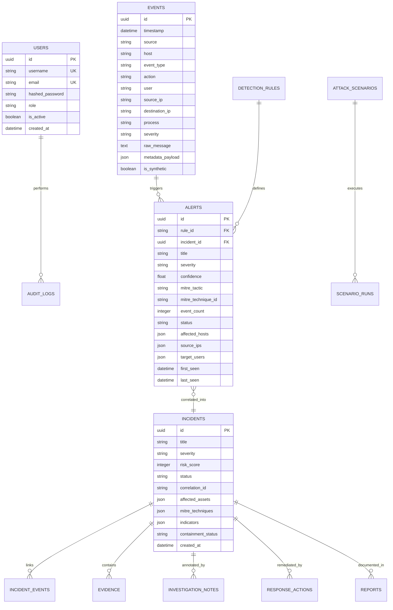

# CyberRange Architecture & Technical Design

## 1. Executive Summary

**CyberRange** is an enterprise-grade Attack Detection & Investigation Lab platform built for Blue Teams, SOC Analysts, and Detection Engineers. It bridges the gap between offensive attack simulations and defensive security operations by providing a realistic, closed-loop pipeline for telemetry generation, log normalization, rule-based detection, incident correlation, risk scoring, evidence management, and threat hunting.

---

## 2. End-to-End System Flow

---

## 3. Component Architecture

### 3.1 Backend Architecture (FastAPI & Async SQLAlchemy)
- **API Gateway**: RESTful endpoints and WebSocket server running on `FastAPI` with Pydantic v2 validation.
- **Normalization Layer** (`backend/app/services/normalizer.py`): Parses diverse log sources (Linux SSH, Nginx access logs, Auditd privilege executions, Sysmon process trees, Zeek connection flows) into a unified `SecurityEvent` schema.
- **Detection Engine** (`backend/app/services/detection_engine.py`): Evaluates behavioral YAML rules, sliding-window thresholds, regex/contains filters, and distinct count conditions.
- **Correlation Engine** (`backend/app/services/correlation_engine.py`): Clusters isolated alerts that share affected hosts, threat actor source IPs, targeted accounts, and temporal proximity into cohesive `Incident` records.
- **Risk Scoring Engine** (`backend/app/services/risk_engine.py`): Computes transparent 0–100 risk scores combining alert severity weights, confidence levels, event frequency, asset criticality, and MITRE kill chain impact.
- **Threat Intel Interface** (`backend/app/services/threat_intel.py`): Pluggable reputation resolver with local JSON dataset support and extensible third-party provider interfaces (VirusTotal, AbuseIPDB, AlienVault OTX).
- **Evidence Management** (`backend/app/services/evidence_service.py`): Computes SHA-256 cryptographic hashes for uploaded artifacts to ensure legal chain-of-custody integrity.
- **Blue Team Training Engine** (`backend/app/services/training_service.py`): Evaluates blind analyst incident responses against ground truth benchmarks and calculates objective Training Scores (0–100).

---

### 3.2 Database Schema & ER Model

---

### 3.3 Frontend Architecture (React 18 + TypeScript + Vite + Tailwind CSS)
- **Single Page Architecture**: Modular page components for Dashboard, Events, Alerts, Incidents, Investigation Workbench, Threat Hunting DSL, Detection Rules, MITRE ATT&CK Matrix, Attack Simulation Lab, Blue Team Training, IOC Vault, Reports, and System Health.
- **Cyberpunk Dark Theme**: Tailored glassmorphism UI tokens, radar sweep animations, risk score dials, and glowing severity indicators.
- **Real-Time WebSockets**: Instant toast banner alerts broadcasted from the backend event loop to analyst sessions without manual polling.
