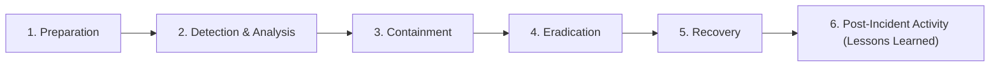

# CyberRange Incident Response & Investigation Guide

## 1. SOC Incident Response Lifecycle (NIST SP 800-61 / PICERL)



CyberRange implements the complete defensive triage lifecycle across its Alert Correlation, Investigation Workbench, and Evidence Management subsystems.

---

## 2. Defensive Response Playbooks

### Playbook 1: Brute Force & Credential Access Triage (`PB-AUTH-01`)
1. **Validate Source IP**: Review geolocation and local threat intelligence reputation score for the threat origin IP.
2. **Review Failure Frequency**: Verify total failed attempts within the temporal sliding window.
3. **Assess Authentication State**: Identify if any subsequent login attempt succeeded (`CR-AUTH-002`).
4. **Inspect Post-Auth Activity**: Check if the compromised account executed interactive shells, sudo elevation, or sensitive file read operations.
5. **Containment**:
   - Issue temporary IP block on perimeter lab gateway.
   - Lock affected user account session (`POST /api/incidents/{id}/actions`).
   - Force credential rotation.
6. **Documentation**: Append triage findings into incident investigation notes and export executive post-mortem.

---

### Playbook 2: Web Application Attack Triage (`PB-WEB-01`)
1. **Request Inspection**: Inspect HTTP method, target URL parameter, and payload body in normalized web logs.
2. **Determine Attack Vector**: Classify attack string (SQLi, XSS, Path Traversal, Directory Discovery).
3. **Analyze HTTP Response Code**:
   - `HTTP 403 / 404 / 500`: Attack blocked or probe rejected.
   - `HTTP 200`: Potential exploitation; inspect response payload size and downstream database/system logs.
4. **Identify Associated Hosts**: Cross-reference host IP and target web application container.
5. **Containment**:
   - Implement WAF blocking rule for malicious query parameters.
   - Patch or isolate vulnerable endpoint.
6. **Evidence Collection**: Hash raw web access log lines with SHA-256 and attach to incident evidence vault.

---

### Playbook 3: Endpoint Suspicious Process & Shell Execution (`PB-END-01`)
1. **Process Identification**: Identify executed binary, command-line arguments, parent process ID (PPID), and spawning user.
2. **Analyze Parent-Child Tree**: Verify if a web server daemon (e.g., `www-data`, `nginx`) unexpectedly spawned an interactive shell (`/bin/bash`, `cmd.exe`, `powershell.exe`).
3. **Decode Obfuscated Commands**: Inspect Base64 payloads or encoded command strings.
4. **Check Outbound Network Activity**: Determine if spawned process established outbound network sockets to adversary C2 IP.
5. **Containment**:
   - Terminate rogue process PID.
   - Isolate host network interface (`lab-linux-01`).
6. **Evidence Acquisition**: Capture process memory artifact, file hash, and execution timeline.

---

## 3. Evidence Management & Chain of Custody

All evidence artifacts collected within CyberRange (raw log snippets, threat intel lookups, screenshots, memory dumps) are cryptographically hashed using **SHA-256** upon ingestion:

```python
# Automatic cryptographic verification
hash_digest = hashlib.sha256(evidence_content.encode("utf-8")).hexdigest()
```

The SHA-256 hash is permanently recorded on the incident timeline to guarantee that evidence submitted in post-mortem reports has not been tampered with or modified.
