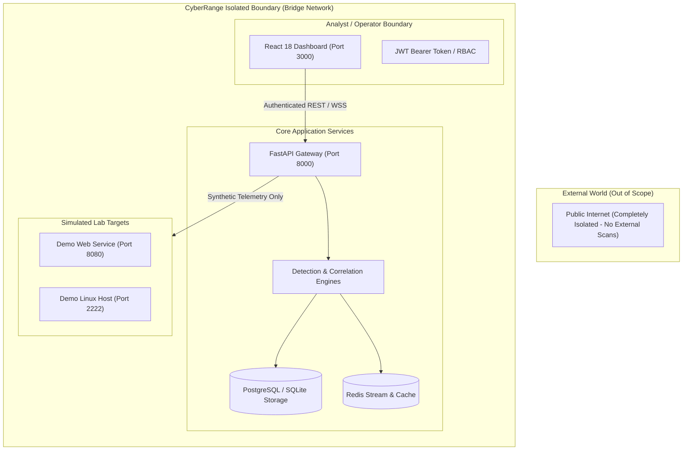

# CyberRange Threat Model & Security Controls

## 1. System Scope & Trust Boundaries

CyberRange operates within a strictly defined, isolated localhost/container boundary:

---

## 2. STRIDE Threat Analysis

| STRIDE Threat Category | Potential Risk in Security Platform | CyberRange Defensive Control |
| :--- | :--- | :--- |
| **Spoofing Identity** | Attacker impersonates SOC Analyst or Admin | Bcrypt password hashing (salt rounds 12), ephemeral JWT tokens with expiration, and RBAC clearance enforcement. |
| **Tampering with Data** | Attacker alters logs to hide intrusion footprints | Log normalizer operates read-only on ingestion; evidence files receive cryptographic SHA-256 integrity hashes stored immutably. |
| **Repudiation** | Analyst denies performing actions (e.g., closing incident) | Centralized `AuditLog` service tracks actor username, source IP, timestamp, action type, and affected resource for all triage events. |
| **Information Disclosure** | Leakage of sensitive secrets or DB credentials | Environment variable isolation (`.env.example`), parameterized SQL queries preventing SQLi, sanitized error handlers suppressing stack traces in production. |
| **Denial of Service** | High-volume log flooding crashing detection worker | Sliding-window threshold aggregation, database indexed queries on timestamps/IPs, pagination on all API endpoints. |
| **Elevation of Privilege** | Read-only VIEWER attempts to modify detection rules | FastAPI dependency injection enforcing `RoleChecker(["ADMIN"])` on write/toggle endpoints. |

---

## 3. Strict Lab Isolation & Safety Assurances

1. **Localhost Only**: All attack simulations run exclusively against containerized endpoints (`lab-linux-01`, `lab-web-01`).
2. **No Real Malware**: Simulators generate synthetic, benign behavioral patterns (e.g., failed SSH strings, safe SQL syntax checks, non-destructive test processes).
3. **No External Attack Automation**: Under no circumstances does the application scan or probe arbitrary third-party hosts on the public internet.
